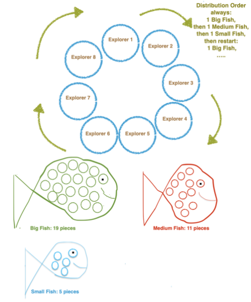
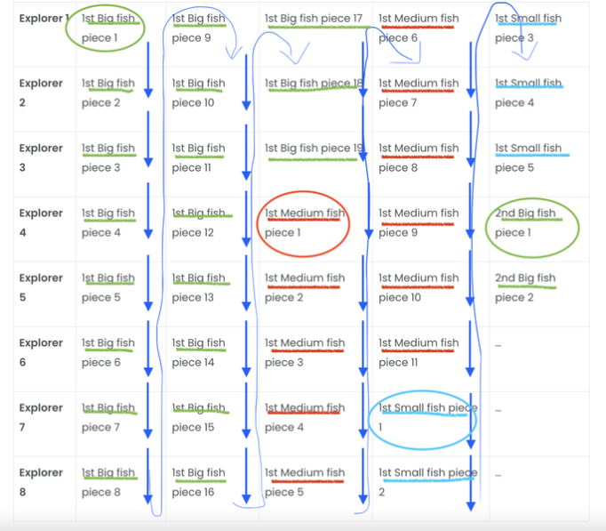

---
Coding Level:
Coding Ideas:
Category: story
Title: Percy and the Humans
Story Genre:
Story Content: penguin, fishing, ice, explore, sharing
Author: Lilly-Elaia-ReedCode and ChatGPT 3.0
Story License: CC BY-NC-SA 4.0 International
Image License:
Image Source:
Audio Source: Coqui TTS https://github.com/coqui-ai/TTS
Parental Rating: 6+
Language: en
---

# Percy and the Humans

Once upon a time, we write the year 3022, November 30, in a land far, far away,
there lived a penguin named Percy. Percy lived in a small, cozy igloo at the
edge of the frozen tundra. He spent his days fishing for krill and swimming in
the icy waters of the Arctic Ocean.

One day, while out fishing, Percy stumbled upon a group of 8 explorers who were
lost in the vast expanse of the frozen north. The explorers were cold, hungry,
and scared, but Percy was determined to help them.

With his sharp eyes and keen sense of direction, Percy led the explorers back to
his igloo. There, he shared his small, medium and big-sized fish and warm
blubber with the grateful travelers sitting around the bond fire 🔥, saving
their lives.

Percy starts passing around a big fish, while each explorer takes a piece. After
19 pieces the fish is fully split. Then Percy continues passing a medium fish to
the next person where the last fish was split. After 11 pieces, the medium fish
was fully split as well. After this the penguin continues passing a small fish
to the next person where the last fish was split. And after 5 pieces, the small
fish was fully split as well. Percy continues to do this for a while in this
particular order. Print how many big fish, medium fish and small fish 🐟 does it
take for every of the 8 explorer to have at least 117 pieces of big fish, medium
fish and small fish? See documentation below.

The explorers were so grateful for Percy’s help that they decided to take him
with them on their journey back to civilization. Together, they traveled across
the frozen tundra, braving the harsh elements and dangerous wildlife.

At last, they reached the safety of a nearby town, where they were welcomed with
open arms. Percy quickly became a local celebrity, known for his bravery and
kindness. He was scared at first, because he hadn’t told anyone yet that he
wasn’t born naturally, but that he was created artificially. He was created
through artificial intelligence exactly 1000 years ago, and that is why he
survived all these years and lived far away in the south pole. But then Percy
took all his courage and told the humans his real origins.

From that moment on Percy lived the rest of his days in comfort and happiness,
surrounded by friends and loved ones. He never forgot his humble beginnings, and
remained grateful for the adventures that had led him to his new home. The end.

## Take a Guess. Non-Codable Questions:

How do you think people 1000 years from now will look at artificial intelligence
(AI) of today?

## Documentation

- 8 explorers sit around bond fire
- Passing around in this order:
  - Big fish with 19 pieces
  - Medium fish with 11 pieces
  - Small fish with 5 pieces

## Print

Number of big fish, medium fish and small fish needed for every explorer to have
least 117 pieces of big fish, medium fish and small fish.

How many big fishes?

How many pieces of big fishes?

How many pieces of small fishes?

## Start

| Explorer | 1st big fish piece | 1st medium fish piece | 1st small fish piece | 2nd big fish piece |
| -------- | ------------------ | --------------------- | -------------------- | ------------------ |
| 1        | 1, 9, 17           | 6                     | 3                    | ...                |
| 2        | 2, 10, 18          | 7                     | 4                    | ...                |
| 3        | 3, 11, 19          | 8                     | 5                    | ...                |
| 4        | 4, 12              | 1, 9                  | ...                  | 1                  |
| 5        | 5, 13              | 2, 10                 | ...                  | 2                  |
| 6        | 6, 14              | 3, 11                 | ...                  | ...                |
| 7        | 7, 15              | 4                     | 1                    | ...                |
| 8        | 8, 16              | 5                     | 2                    | ...                |
